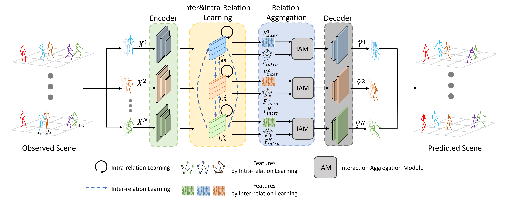

### Relation Learning and Aggregate-attention for Multi-person Motion Prediction

### Abstract
------
Multi-person motion prediction is an emerging and
intricate task with broad real-world applications. Previous methods
achieve impressive results by modeling the spatial relations of
all individuals’ joints and the temporal trajectory of a particular
individual. However, they may ignore the distinction between
the spatial relationships within a person and those between
multiple persons, which inevitably introduces undesired dependencies.
To address this issue, we introduce a new collaborative
framework for multi-person motion prediction that explicitly
models these relations: a GCN-based network for intra-relations
(spatio-temporal relations inside a person) and a novel reasoning
network for inter-relations (spatial relations between persons).
Moreover, we propose a novel plug-and-play aggregation module
called the Interaction Aggregation Module (IAM), which employs
an aggregate-attention mechanism to seamlessly integrate these
relations. Experiments indicate that the module can also be
applied to other dual-path models. Extensive experiments on
the 3DPW, 3DPW-RC, CMU-Mocap, MuPoTS-3D, as well as
synthesized datasets Mix1 & Mix2 (9∼15 persons), demonstrate
that our method achieves state-of-the-art performance.

### Network Architecture
------



### Visualization
------
__Scene (2 persons):__

 &nbsp;&nbsp;&nbsp;&nbsp;&nbsp;&nbsp;&nbsp;&nbsp; 


__Scene (3 persons):__

 &nbsp;&nbsp;&nbsp;&nbsp;&nbsp;&nbsp;&nbsp;&nbsp; 

### Requirements
------
- PyTorch = 1.8.0
- Numpy
- CUDA = 11.4
- Python = 3.1.0

### Data Preparation
------
Download all the data and put them in the [dataset path].

[3DPW](https://virtualhumans.mpi-inf.mpg.de/3DPW/)

[CMU mocap](http://mocap.cs.cmu.edu/) 

[MuPoTS-3D](https://vcai.mpi-inf.mpg.de/projects/SingleShotMultiPerson/) 


### Training
------
To train our model, please try
```
python main.py
```


## Evaluation
------
Add `--is_eval` after the above training commands.

The test result will be saved in `./checkpoint/`.

#### Ackowlegments
Our code is based on [JRT](https://github.com/MediaBrain-SJTU/JRTransformer) and [MRT](https://github.com/jiashunwang/MRT).
